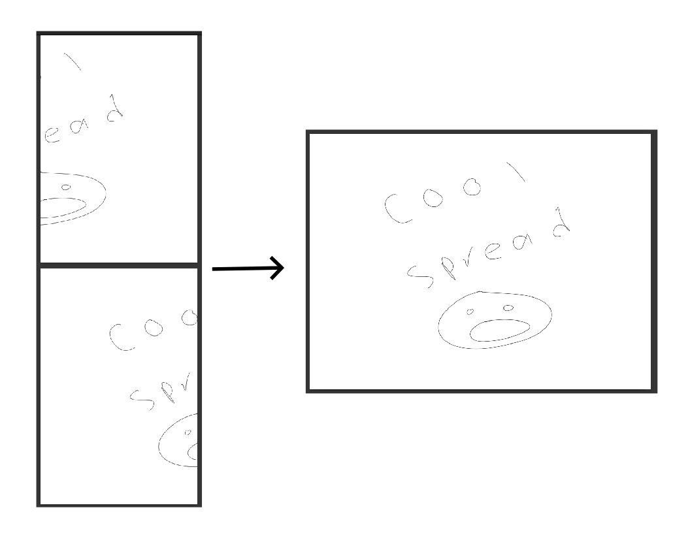

# Spread Stitcher



Correctly show manga spreads by stitching / merging / combining the pages of a
cbz. 

## Background
My e-reader (Supernote A5X) has a simple pdf viewer that doesn't allow for
showing two pages at once or reversing the page order for right-to-left files.
This meant any of that display work needed to be in the cbz itself. So, this
script reverses the page order and joins every even page with the next odd page
to make spreads for any simple pdf viewer.

In general, if you're reading on a device with a more capable pdf viewer,
I'd recommend using its functionalities over this since this would needlessly
modify your files. Most image viewers should let you view pages side by side,
and if your viewer can't reverse the page numbers you may be able to do so by
reversing the page number with print-to-pdf or
[other tools](https://unix.stackexchange.com/q/439959).

Another alternative is
[manga-spread-merger-ext](https://github.com/dauom/manga-spread-merger-ext) by
@dauom which merges spreads for websites. This project is designed for local
cbzs and to be read offline, but if you're accessing files online this may be a
better project for you.

## Install
This script requires [Python 3](https://www.python.org/) and the
[Pillow image library](https://python-pillow.org/). Pillow can be installed
by running

```sh
pip install pillow
```

You can then clone the repository to have access to the script,
`spread_stitcher.py`. If you aren't familiar with Git, you can also click
[here](https://github.com/aidandenlinger/Manga-Spread-Stitcher/raw/main/spread_stitcher.py)
to open the script, and hit CMD-S/CTRL-S to save the file.

## Usage
This is a CLI tool. Once you open a terminal with the working directory
in this repo, you can run it with

```sh
python3 spread_stitcher.py --help 
```
to see all options.

When not creating a volume, the original cbzs are renamed by adding an
`_original` to their name, and the stitched cbz will have the original file
name. This is used so you can manually check the merge job and ensure there are
no issues. You can use `-d` to instead delete the original cbzs once stitching
is successful.

When creating a volume with `-v`, a new cbz will be made with the name
`firstfilename-lastfilename.cbz`. `-d` will still work to delete the original
cbz files.

This script uses parallelization - many .cbzs will be merged at once. Each
file will output to the console when it has started and when it has finished.
You can use `-q` to silence these outputs. Errors will still be printed.

A page will be inserted at the beginning of the merged pdf saying to go to the
back of the pdf to start the chapter. You can use `-w` to not add this page, but
be warned that when you open the pdf, the last page of the manga will
be immediately displayed. You can customize the message and font by editing
`go_to_back_text` and `font_size` at the beginning of the script. You can change
the font by changing `font_ttf` to the name of the ttf file holding the font you
want to use that is in your font library.

There's a basic example of an unstitched cbz and a stitched cbz in the
[example](example) folder.

Some basic examples:

```sh
# See help
python3 spread_stitcher.py --help

# Stitch Chapter 1 in the ~/Documents/Manga folder
# The stitched file will be named "ch1.cbz" and the
# original file will be renamed to "ch1_original.cbz"
python3 spread_stitcher.py "~/Documents/Manga/ch1.cbz"

# Stitch all chapters in the ~/Documents/Manga folder using shell globs
python3 spread_stitcher.py "~/Documents/Manga/*.cbz"

# Stitch all chapters in the ~/Documents/Manga folder, don't print any updates
# (-q), and delete the original, nonstitched cbzs (-d)
python3 spread_stitcher.py -qd "~/Documents/Manga/*.cbz"

# Stitch ch1 through ch3 into a new cbz named ch1-ch3.cbz (-v)
python3 spread_stitcher.py -v ch1.cbz ch2.cbz ch3.cbz
```

## Contributing
Feel free to ask questions by making a new Issue, or submit a PR with any
new features! I'm not planning on adding many new features as this achieves
everything I need it to do, but I'm more than happy to merge anything that
adds functionality.

## License
MIT
